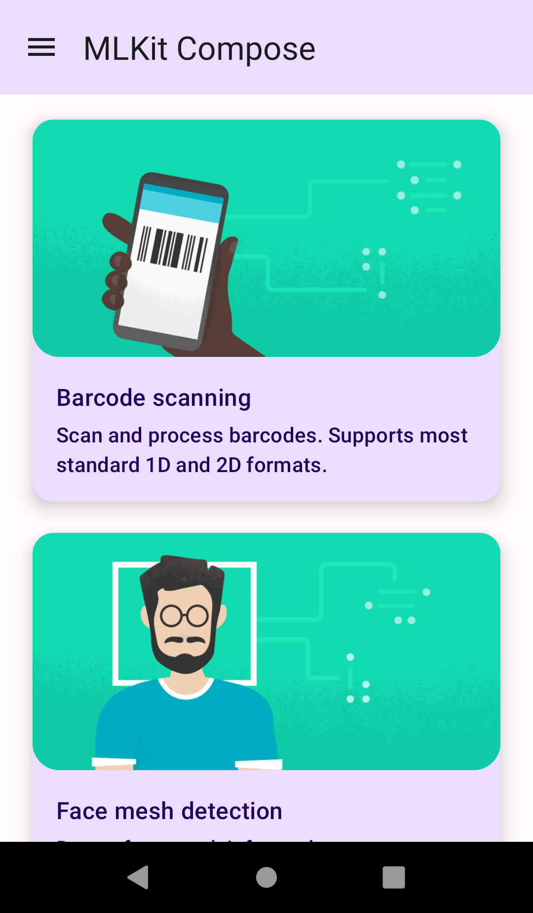
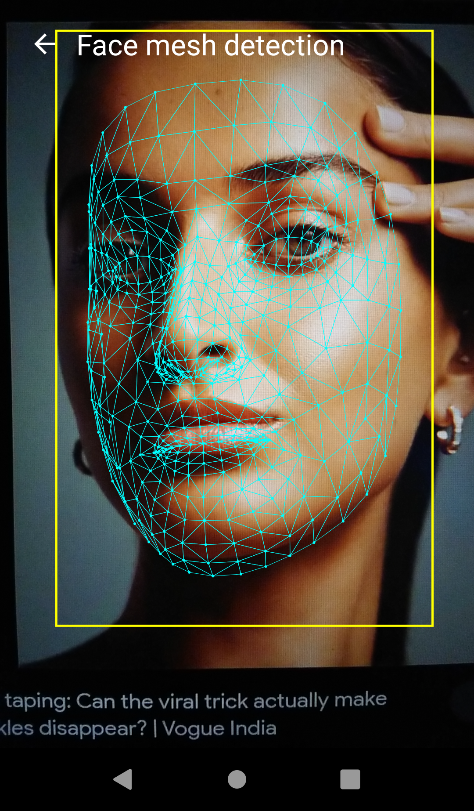
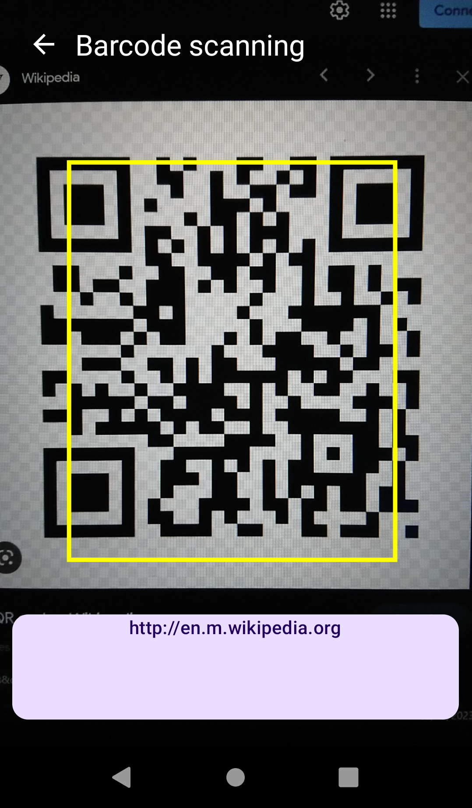
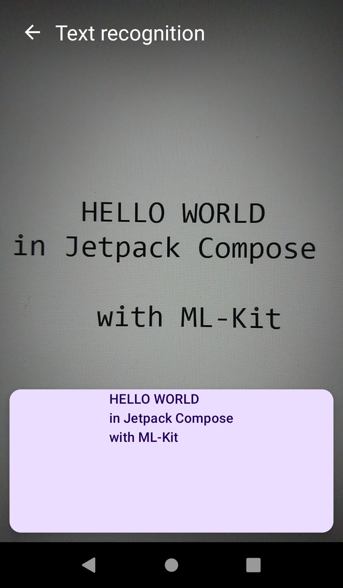

<h1 align=center> ML-Kit in Jetpack Compose 📱</h1> 

Jetpack compose project showcasing MLKit vision-based use-cases.

 
  
  
  
  

* [Text recognition](https://developers.google.com/ml-kit/vision/text-recognition/v2?hl=en): Recognize and extract text from images.
* [Face mesh detection](https://developers.google.com/ml-kit/vision/face-mesh-detection?hl=en): Detect face mesh info on close-range images.
* [Image labeling](https://developers.google.com/ml-kit/vision/image-labeling?hl=en): Identify objects, locations, activities, animal species, products, and more.
* [Barcode scanning](https://developers.google.com/ml-kit/vision/barcode-scanning?hl=en): Scan and process barcodes. Supports most standard 1D and 2D formats.
* [Object detection](https://developers.google.com/ml-kit/vision/object-detection?hl=en): Localize and track in real time one or more objects in the live camera feed.
